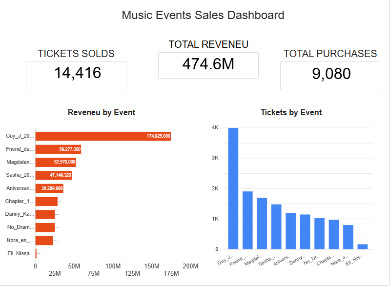
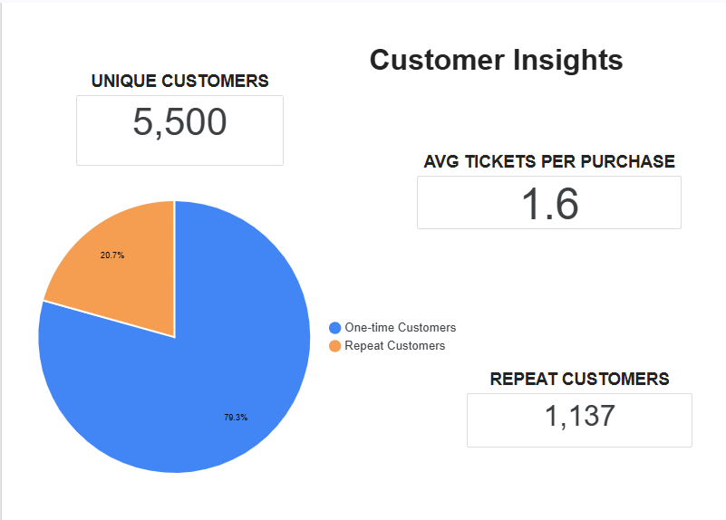

# 🎵 Music Events Sales Dashboard

## 📌 Project Overview

This project analyzes ticket sales from 10 electronic music events held in Argentina using SQL, Google BigQuery, Google Sheets, and Looker Studio.

The objective was to transform raw transactional data into an interactive dashboard that provides insights into sales performance and customer behavior.

The dashboard answers key business questions such as:

- Which events generated the highest revenue?
- Which events sold the most tickets?
- How many unique customers attended the events?
- How many customers returned to multiple events?
- What is the average number of tickets purchased per transaction?

---

## 🛠️ Tools Used

- SQL
- Google BigQuery
- Google Sheets
- Looker Studio

---

## 📂 Dataset

The dataset contains ticket sales information from **10 electronic music events**, including:

- Purchase transactions
- Ticket quantities
- Revenue
- Event information
- Customer IDs (anonymized)

To protect customer privacy, all personal information was anonymized before analysis.

---

## 🧹 Data Preparation

Before building the dashboard, the dataset required several cleaning and validation steps:

- Consolidated data from multiple CSV files into a unified dataset.
- Standardized column names and data formats.
- Converted data types to support SQL analysis.
- Organized the data into analysis-ready tables in BigQuery.
- Anonymized customer information using unique customer IDs.
- Identified and corrected missing (`NULL`) values during data validation.
- Cross-checked revenue and ticket totals between transactional and aggregated datasets to ensure data accuracy.
- Validated calculations before creating the dashboard.

---

## 📊 SQL Analysis

The SQL queries were developed to answer key business questions, including:

- Total Revenue
- Total Purchases
- Total Tickets Sold
- Unique Customers
- Revenue by Event
- Tickets Sold by Event
- Average Purchase Value
- Customer Loyalty (One-time vs. Repeat Customers)

All SQL queries are available in the **SQL** folder.

---

## 📈 Dashboard Preview

### Sales Performance

### Customer Insights

---

## 🔑 Key Insights

- **Total Revenue:** 474.6M
- **Tickets Sold:** 14,416
- **Total Purchases:** 9,080
- **Unique Customers:** 5,500
- **Repeat Customers:** 1,137 (20.7%)
- **Average Tickets per Purchase:** 1.6

---

## 💼 Skills Demonstrated

- Data Cleaning
- Data Validation
- SQL Query Development
- Google BigQuery
- Dashboard Design
- Business Intelligence
- Data Visualization
- Customer Behavior Analysis

---

## 🚀 About This Project

This project was developed as part of my Data Analytics portfolio to demonstrate practical skills in data preparation, SQL querying, Google BigQuery, and dashboard development using real-world event sales data.

Throughout the project, I worked on cleaning and validating the dataset, identifying data quality issues, developing SQL queries to answer business questions, and designing an interactive dashboard to communicate the results effectively.
